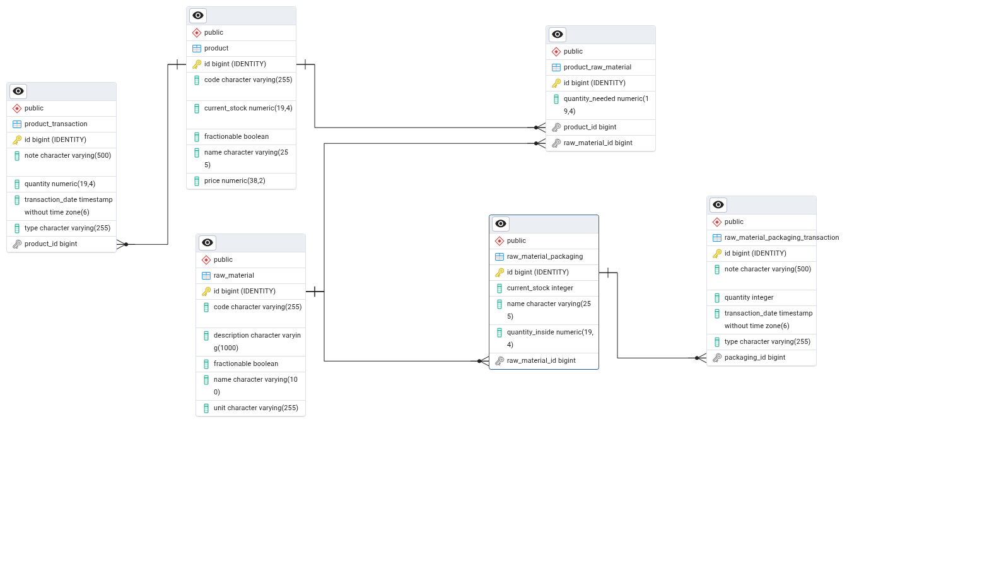
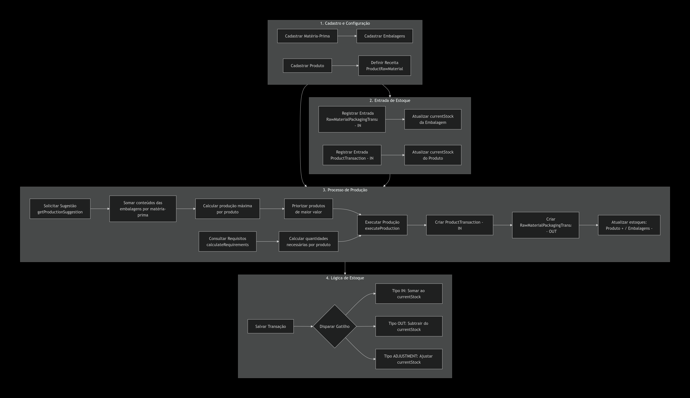
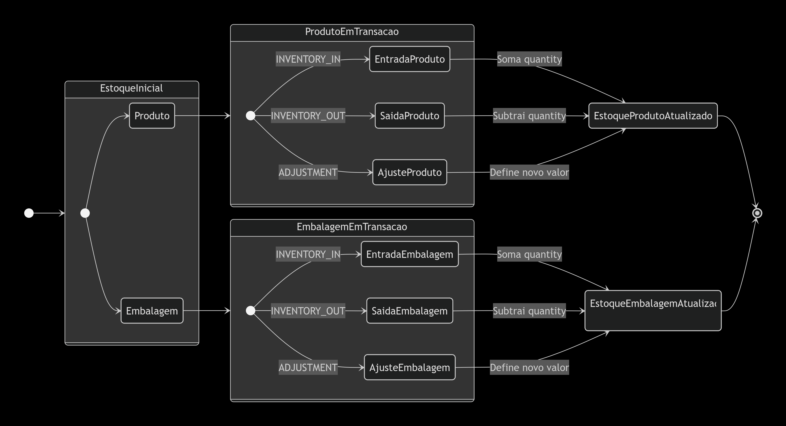
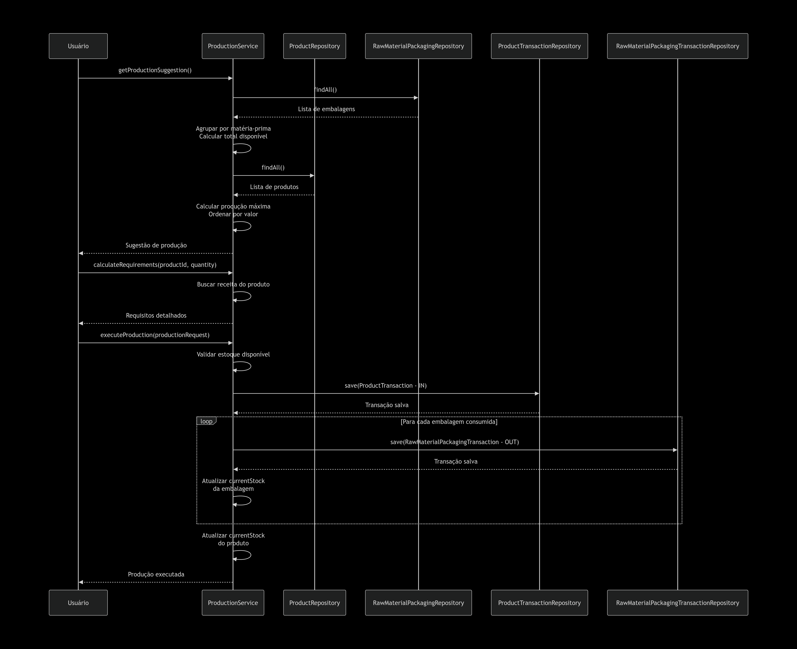

# Inventory & Production Manager

Sistema completo de gerenciamento de inventário e produção, composto por uma API REST robusta em Spring Boot e um cliente frontend moderno em Vue 3.

O objetivo principal do sistema é controlar o estoque de insumos (matérias-primas), gerenciar produtos acabados e sugerir/executar ordens de produção com base na disponibilidade de materiais, priorizando produtos de maior valor agregado.

## Visão Geral

O projeto é dividido em módulos principais:

1.  **api (Backend)**: API desenvolvida em Java/Spring Boot responsável pela lógica de negócios, persistência de dados e regras de produção.
2.  **client (Frontend Principal)**: Aplicação web desenvolvida em Vue 3/TypeScript interfaceando com a API para fornecer uma experiência de usuário fluida.
3.  **client-example-react (Referência)**: Versão original da interface desenvolvida em React/Redux mantida como base de código de referência.

---

## Tecnologias Utilizadas

### Backend
*   **Java 21** & **Spring Boot 3.4.2**
*   **Banco de Dados**: H2 (Dev) / PostgreSQL (Prod)
*   **Spring Data JPA** (Hibernate)
*   **Lombok**
*   **SpringDoc OpenAPI** (Swagger UI)
*   **Maven**

### Frontend (Vue)
*   **Vue 3** (Composition API)
*   **TypeScript**
*   **Vite**
*   **Tailwind CSS v4**
*   **Pinia** (State Management)
*   **Vue Router**
*   **Vitest** (Testes)

---

## Funcionalidades Principais

*   **Controle de Estoque**: Gerenciamento de Produtos e Matérias-Primas.
*   **Produção**:
    *   Associação de receitas (matérias-primas necessárias para um produto).
    *   Sugestão automática de produção baseada no estoque atual.
    *   Execução de produção com baixa automática de insumos e entrada de produtos acabados.
*   **Transações**: Registro de entradas e saídas manuais.
*   **Apresentações (Packagings)**: Controle de embalagens e variações de insumos.

---

## Como Executar o Projeto

### Pré-requisitos
*   Java 21 JDK instalado
*   Node.js (v18+) e npm/yarn
*   Git

### 1. Clonar o Repositório
```bash
git clone https://github.com/seu-usuario/inventory-product-manager-spring.git
cd inventory-product-manager-spring
```

### 2. Executar o Backend
O backend deve ser iniciado primeiro para que o frontend possa se conectar.

```bash
cd api
./mvnw spring-boot:run
```
*   A API estará disponível em: `http://localhost:8080`
*   Documentação Swagger: `http://localhost:8080/swagger-ui/index.html`

### 3. Executar o Frontend
Em um novo terminal (na raiz do projeto):

```bash
cd client
npm install
npm run dev
```
*   O frontend estará disponível em: `http://localhost:5173` (ou a porta informada pelo Vite dependendo da disponibilidade)

---

## Documentação Detalhada

Para informações específicas sobre cada parte do projeto, incluindo diagramas de arquitetura, endpoints detalhados e estrutura de testes, consulte as pastas individuais.

---

## Arquitetura e Diagramas

O sistema segue uma arquitetura separada (Client-Server). Abaixo estão os diagramas do modelo de dados e fluxos utilizados na API:

### Modelo de Dados (ERD)


### Fluxograma de Produção


### Diagrama de Estados


### Diagrama de Sequência

